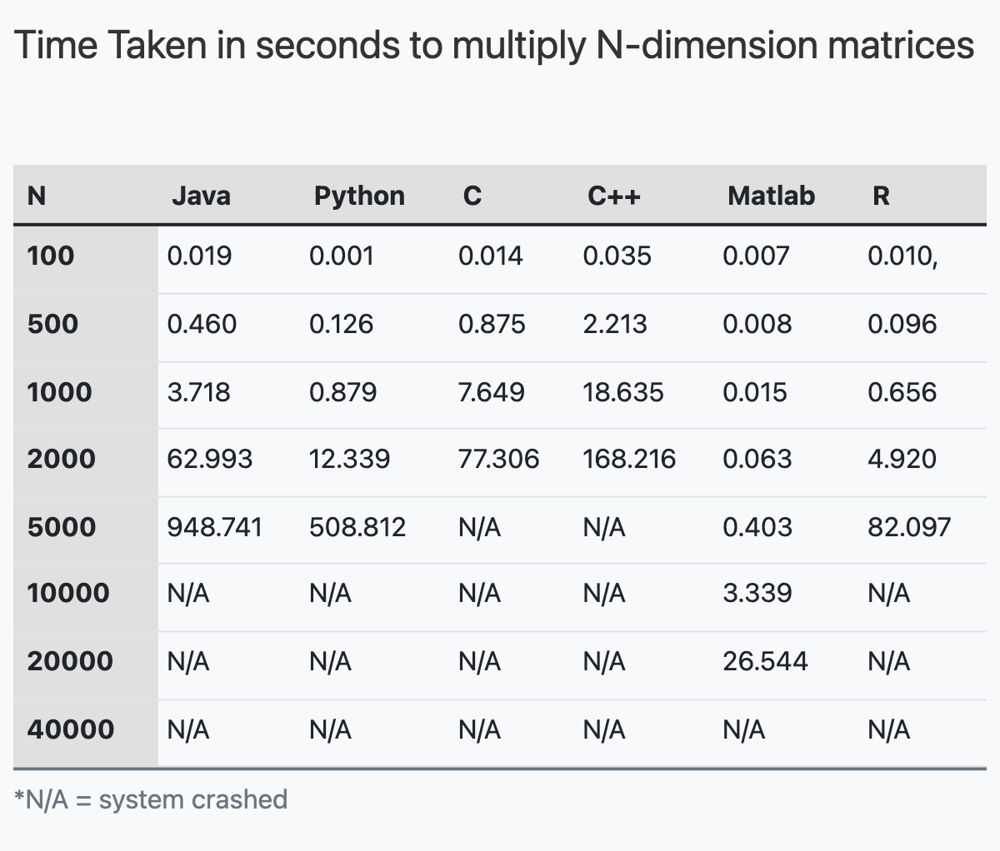

# MatrixMultiplication

I am comparing the runntime of different programing languages like Java, Python, C, C++, R and Matlab to determine the best language for matrix multiplication for square matrices

